# CamRaff - Milestone Project 3 - Rogues Den

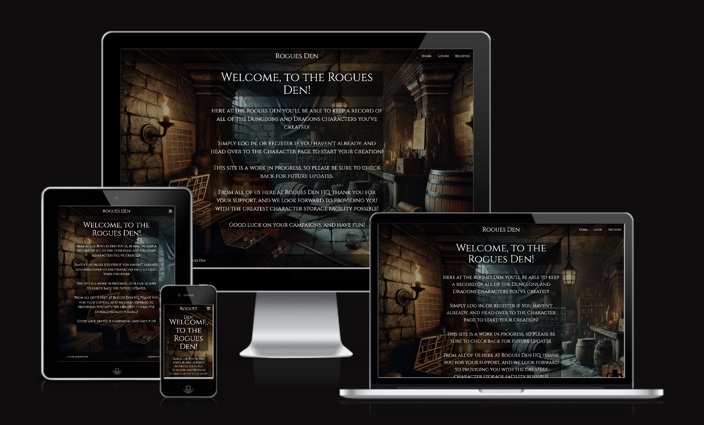

Here is a link to the deployed site: [Rogues Den](https://rogues-den-mp3-918bccafa7f4.herokuapp.com/)

For my third Milestone Project on my course through Code Institute via UCP (University centre Peterborough), I thought it would be fun to create my own version of a Dungeons & Dragons character creation/storage site to allow people to keep track of the characters they have, whether it be few or many! In an ideal world, the site I have created would have the capability to allow for the creation of all race/class combinations, however, in order to ensure I can produce the best project I can within the time I have available, I have chosen to limit the race and class choices to those from the Player's Handbook (2014).

---

# Contents

- [User Experience](#user-experience-ux)

  - [User Stories](#user-stories)

- [Design](#design)

  - [Wireframes](#wireframes)

    - [Desktop Views](#desktop-views)

    - [Mobile Views](#mobile-views)

  - [Images](#images)

  - [Typography and Color Scheme](#typography-and-color-scheme)

  - [Database Schema and User Journey](#database-schema-and-user-journey)

    - [Database Schema](#schema)

    - [User Journey](#journey)

  - [Features](#features)

    - [Common Features](#common-features)

    - [Site Pages](#site-pages)

      - [Desktop](#desktop)

      - [Mobile](#mobile)

    - [Delete Modal](#delete-modal)

    - [Flash Messages](#flash-messages)

    - [Error Pages](#error-pages)

  - [Accessibility](#accessibility)

  - [Future Updates](#future-updateschanges)

- [Development](#development)

  - [Languages](#languages)

  - [Databases](#databases)

  - [Frameworks](#frameworks)

  - [Libraries/Packages](#librariespackages)

  - [Other Programs/Websites](#other-programswebsites)
  
  - [Defensive Programming](#defensive-programming)

  - [Error Handling](#error-handling)

- [Deployment and Local Development](#deployment-and-local-development)

  - [Deployment](#deployment)

  - [Local Development](#local-development)

    - [Fork](#fork)

    - [Clone](#clone)

- [Testing](#testing)

- [Credits](#credits)

  - [Sites](#sites)

  - [Page Content](#page-content)

  - [Acknowledgements](#acknowledgements)

---

# User Experience (UX)

## User Stories

### First Time Visitors

- I am new to Dungeons & Dragons and I want to find a website that will allow me to store my characters from my different campaigns.
- I want to find a website that is straight forward and easy to use. 
- I want to find a website which has a great vibe and cool visuals.

### Returning Visitors

- I want to be able to update my characters as I level up throughout my campaigns.

### Frequent Visitors

- I want to see if there are any new additions to character creation and other features on the site. 

---

# Design

## Wireframes

Below you can find the inital mock-ups for all of the pages for the site on both desktop and mobile. The wireframes were all created using [Balsamiq](https://balsamiq.com/wireframes/).

### Desktop Views

- #### Home Page

I wanted to keep the home page relatively simple as this is just an introduction, and all of the main focus should be on the character page.

- #### Login/Register Pages

This is the login page which will either log you in or take you to register if not already registered. Clicking log in will take you to the characters page.

This is the register page, very similar to the login page. Clicking submit will take you to the characters page.

- #### Profile Page

This is the profile page where you can see your details, and from here update them if you wish. This is where you can logout from your account.

This is a view of the edit account page.

- #### Character Pages

This is the page where all of the users are stored and from here you can create, view, edit and delete the characters you create. The idea is to have the card that is displayed show the character name, an image of the race they picked, and have a drop down to display the stats of their character.

This is the create/add character page, kept relatively simple.

This is how the character will be displayed to the user after they have created them and clicked on the card visible on the character page.

This is the edit character page, very similar to the create/add character page, however the name and race of the character are not changeable once submitted.

This is the defensive programming pop-up to check if they're sure and to notify them that their decision will be final.

### Mobile Views

- #### Home/Login/Register

- #### Profile/Edit Profile/Characters

- #### New Character/Character/Edit Character

As you can see, the mobile views simply takes the desktop view and translates it more vertical than horizontal. The erase pop-up will appear the same on mobile as on desktop.

## Images

As I have gone with a Dungeons & Dragons style character creation/storage site, I decided for the site background to have a bit of a dark and grungy dungeon/vault style image. The image was created using the prompt "give me an image of a rogue's den" on [ChatGPT](https://chatgpt.com/)

Just incase there were any issues displaying the above image on a smaller device, I also got the below created.

As I was originally planning to give users the ability to change and upload their own profile image, I got [ChatGPT](https://chatgpt.com/) to create a blank profile picture as a place holder. Unfortunately I did not end up implementing the change feature but the blank image is visible on the user profiles and appears as below.

### Race Images

The following are the images used as a display of character race. All of these images were acquired using AI from [Canva](https://www.canva.com/). When creating a character, the image displayed will be different for each character depending on which race you have selected for your character. See the [Characters](#characters-page) page for an example.

#### Dragonborn

#### Dwarf

#### Elf

#### Gnome

#### Half-Elf

#### Half-Orc

#### Halfling

#### Human

#### Tiefling

### Favicon

I acquired an image from [ChatGPT](https://chatgpt.com/) that I was originally going to use for the Dragonborn race, however I was struggling to use ChatGPT to get images for the rest of the classes, so I decided to go with [Canva](https://www.canva.com/) for those, and kept the original Dragonborn image and used it to created the [Favicon](https://favicon.io/). The image is as follows:

## Typography and Color Scheme

As this website had an image for a background, there wasn't much in the way of thought for a color scheme, as the image itself was quite dark due to the nature of the design. The only thing which required thought was what color the fonts would be, and a way to make the input and text boxes stand out slightly from the background itself. 

### Color Scheme

In order to allow for the background to be visible 99% of the time, I opted to use the rgba color format, leaving the red, blue and green options at 0, so they stayed clear, and then edited the opacity to make it slightly more opaque, leaving the background visible but also providing a background for the text.   The background was a little too light to provide contrast against the white text I'd decided upon, so I layered the background with rgba(0, 0, 0, 0.5) to give it more of a dark hint, and I added a background of rgba(0, 0, 0, 0.4) to the input and text boxes to provide that a background and further contrast for the text, while also allowing the background image to be visible. 

### Font and Color

To find a suitable font, I went to [Google Fonts](https://fonts.google.com/) and and after a bit of searching came across the 'Cinzel' font. I decided to go with this font as it provided a quite regal feel, which I thought went well with the Dungeons & Dragons vibe I was going for. 

I believe this font was a good choice, as it is clear and easy to read, while also being very stylized and works well with the theme of the website. 

## Database Schema and User Journey

### Schema

In order to create the database schema, I used [DB Designer](https://erd.dbdesigner.net/login). The schema was as follows:

The database was relational, with the Users table linking to the Character table via "db.relationship" and the Character table using the users_id as a foreign key to link the characters created to that specific user.

### Journey

The below flowchart is designed to show the user journey, and I created it using [draw.io](https://www.drawio.com/).

The flowchart above shows the main navigational routes throughout the website. Naturally there are other links, but to keep the flow chart clear and readable I decided to only show the main routes. The home page is accessible from each page on the website via the title in the navigation bar. Before a user is verified, the navigation bar displays "Home", "Login" and "Register". Following logging in, the navigation bar displays "Characters" and "Profile".

## Features

The site contains a total of 9 pages and are as follows: 

- Home (open to everybody)
- Login (open to everybody)
- Register (open to everybody)
- Characters (requires authentication)
- Profile (requires authentication)
- View Character (requires authentication)
- Edit Character (requires authentication)
- Custom 404 (error page)
- Custom 500 (error page)

### Common Features

There are several common features on this site. The navigation bar remains the same accross the site, however the available options change based on user authentication. The footer remains the same across the site. The font I have chosen for the website remains the same across each page and all element types. It works extremely well across the board. Below you can see an image of each of the common features.

#### Navigation Bar - Unauthorized

#### Navigation Bar - Authorized

#### Footer

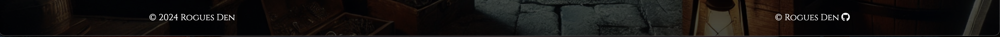

### Site Pages

Below you can see all of the site pages on both desktop and mobile.

#### Desktop

##### Home Page

##### Login Page

##### Register Page

##### Characters Page

##### Add Characters Page

All stats are visible with their full title, as it fits well on larger screens. I noticed during development that these titles did not quite fit on mobile, so I added a JavaScript function to change and abbreviate them for mobile.

##### View Character Page

I implemented the same change as above for the character view page as well. 

##### Profile Page

I had originally planned to have the profile editable, however as full CRUD functionality had been achieved with character creation, I decided that this wasn't a necessary implementation at this time.

#### Mobile

##### Home Page

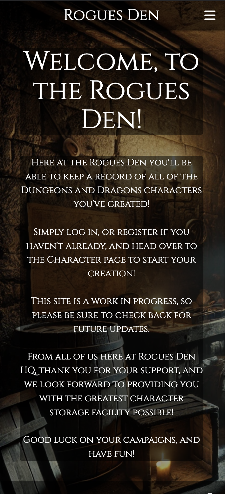

##### Login Page

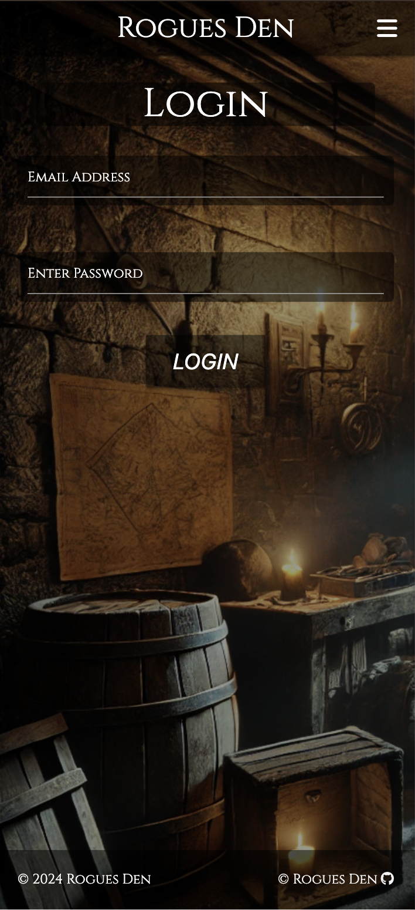

##### Register Page

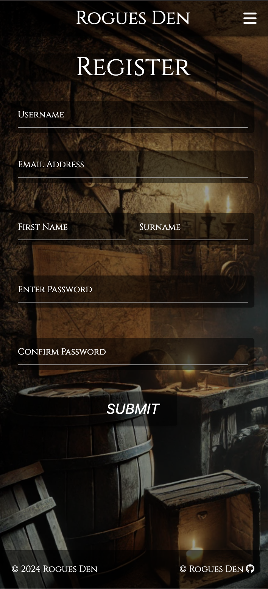

##### Characters Page

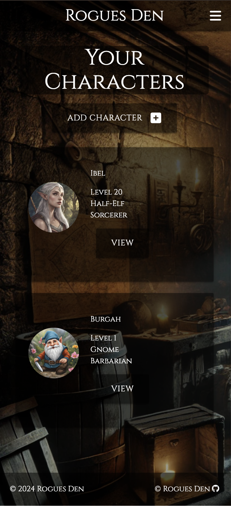

##### Add Characters Page

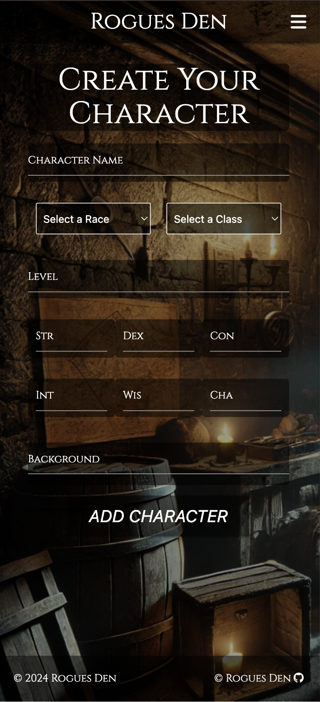

As you can see, the stat titles have changed and are now abbreviated as they are being displayed on a smaller screen.

##### View Character Page

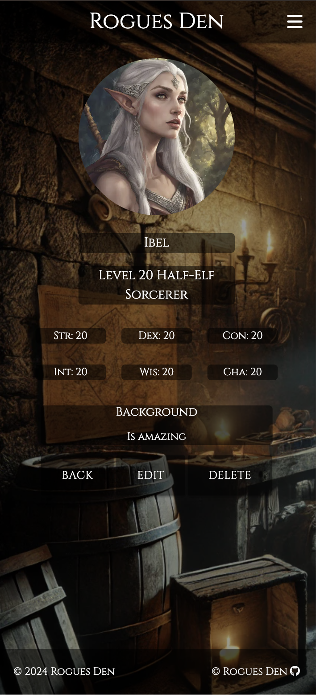

As you can see, the stat titles have changed and are now abbreviated as they are being displayed on a smaller screen.

##### Profile

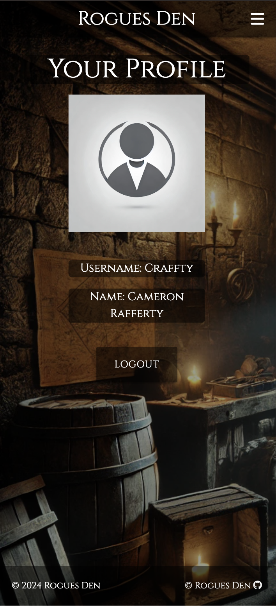

### Delete Modal

I added a modal to double check that deleting the chosen character is what the user is wanting to do. The delete button is found on the character view page, and looks as follows:

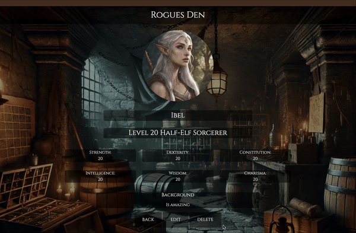

### Flash messages

There are several flash messages implemented in the site. There is one for successful/failed login, successful/failed registration, successful/failed character creation, successfully updated character, character deletion and successful log out.

### Error Pages

The site picks up on 404, 500 and 401 errors, and I created custom error pages for a 404 error and a 500 error. They both follow them same procedure of linking the user back to the home page via a link in the main content. They are the same on both desktop and mobile so I have decided to show only on desktop, and are as follows:

#### 404

#### 500

#### 401

The 401 error occurs when trying to access the characters/profile page without being authenticated and directs you to the login page with an error and looks as follows:

## Accessibility

I tried to create this site so it was as user friendly as possible. In order to do this I:

- Developed the website using semantic HTML.
- Provided alternative and informative text for all images.
- Provided aria-labels for all links throughout the site that aren't already labelled (like buttons for example).
- Attempted to provide as much of a colour contrast as possible between the background and the text, while also maintaining the visibility of the background for the best user experience possible.

## Future Updates/Changes

If I were to continue development of this site, there are several features I would like to implement. They are as follows:

- I would like to have email confirmation upon successful registration.
- I would like to implement more race/class options.
- I would like to implement a feature which provides a description of the races/classes chosen and their given attributes.
- I would like to implement profile customization as this was a feature I already wanted and I think it adds an extra bit of personalisation and also links into the next future update point.
- I like the idea of creating a "campaign" page, where you can join a created campaign with your friends and keep track of the campaign and see how eachothers characters are developing throughout the campaign.

---

# Development

## Languages

This website was created using the following development languages:

- HTML (front-end basics)
- CSS (front-end customization)
- JavaScript (front-end functions)
- Python (back-end)

## Databases

[Postgres](https://www.postgresql.org/) was the platform I used to provide the relational database used to store the tables needed for the site. In the database I had two tables, those being the "Users" table and the "Character" table. The first table was used to store the users desired username, email, first name, last name and password. The second table was used to store all of the details for their created character. Those details were their character name, level, strength, dexterity, constitution, intelligence, wisdom, charisma, and a background for that character. The background is optional, as it often requires a lot more thought so it can be uploaded at a later date via editing the chosen character. 

## Frameworks

- [Flask](https://flask.palletsprojects.com/en/stable/) was used to build the site utilizing Python.
- [Materialize](https://materializecss.com/) was used to help create the front-end of the website. This was extremely helpful as it provided built in responsiveness and great features. 

## Libraries/Packages

- [Flask-Login](https://flask-login.readthedocs.io/en/latest/) was used to provide the functionality for registering, logging in and out, and user authentication.
- [Flask-Blueprints](https://flask.palletsprojects.com/en/stable/tutorial/views/) was used to provide logical organisation of the routes within the app. It's main purpose was to allow me to separate the authentication routes from the regular routes. This was useful as it makes the app a lot easier to maintain and provides a much cleaner development environment.
- [SQLAlchemy](https://www.sqlalchemy.org/) was used as it simplified the database interaction and allowed me to work directly with the relational database using Python objects.
- [Flask-SQLAlchemy](https://flask-sqlalchemy.readthedocs.io/en/stable/) was used as another way of interacting directly with the database. 

## Other Programs/Websites

Here is a list of other programs and websites not yet specified previously that I used throughout the development of the site and README:

- [Pip](https://pypi.org/project/pip/) - for installing the necessary packages for development.
- [Jinja](https://jinja.palletsprojects.com/en/stable/) - a templating language used in Python development to display back-end information on the front-end.
- [Git](https://git-scm.com/) - used for version control.
- [GitHub](https://github.com/) - used to save and store the project repository throughout development.
- [Heroku](https://www.heroku.com/) - used for deployment of the site upon completion.
- [Gitpod](https://www.gitpod.io/) - the IDE used throughout development (provided by Code Institute).
- [AmIResponsive](https://ui.dev/amiresponsive) - used to create the main image at the top of the README and TESTING documents.
- [Ezgif](https://ezgif.com/video-to-gif) - used to create the gifs used throughout the README and TESTING documents.
- [Font Awesome](https://fontawesome.com/) - used to acquire the icon used for the GitHub link in the footer.
- [Google Dev Tools](https://developer.chrome.com/docs/) - was used a means of testing the website throughout its production.

## Defensive Programming

I implemented defensive programming as a way of protecting the site, maintaining the database and authenticating users to ensure the site was displayed the way I wanted and the correct data could be brought from the database. Users must be authenticated to view the important parts of the site, like the Character and Profile pages. Some of the defensive methods were: 

- Login required for Character and Profile view.
- Limitations on string and integer inputs. 
- Specific requirements for email and passwords. 
- 401, 404 and 500 error implementation.

## Error Handling

For this site I implented custom 404 and 500 error pages to allow for their customization and to provide a better user experience, which you can see above. As a 500 error is quite hard to force, I added a route to force a 500 error to ensure that it is working, which prompts the browser to provide the 500 error page. The code was as follows: 

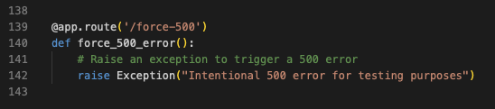

To force this error, simply replace the end of the current url with "/force-500" and you will be provided with the 500 error page you can see above.

# Deployment and Local Development

## Deployment

I deployed this project on Heroku and the steps to do so were as follows: 

1. Create a "requirements.txt" and a "Procfile".
    - to create the requirements.txt you can type "pip3 freeze --local > requirements.txt" into the terminal.
    - to create the Procfile you can type "echo web: python run.py > Procfile" into the terminal. You must ensure the P is capitalized and you haven't added any extensions to the end. You will know this has been done correctly if you can see the Heroku logo beside the file name. 
2. Login (or sign up if you havent already) to Heroku.
3. Click the "New" button at the top right of the dashboard and select "Create new app".
4. Add a unique name and select the correct region. Once done, click "Create app".
5. Connect your created Heroku app to your GitHub repository in the "Deploy" section. You can enable "Automatic Deploys" to ensure all pushed changes deploy straight to Heroku, if you wish.
6. Head to the "Settings" section and click to "Reveal Config Vars". Once there, input your desired environment variables. See below for an example:
    | KEY          | VALUE             |
    | :----------- | :---------------- |
    | IP           | 0.0.0.0           |
    | PORT         | 5000              |
    | SECRET_KEY   | YOUR_SECRET_KEY\* |
    | DATABASE_URL | POSTGRES_DB\*     |
    \*Denotes a value that is specific to your app.
7. Click the "More" button at the top right and select "Run console". Once here, type "python3" and click "Run".
8. Once inside the terminal, type "from rogues_den import db" and press enter, then type "db.create_all()" and press enter. This will create the tables you've designed in the relational database URL that you've specified in the Config Vars.
9. Exit the terminal by typing "exit()" and pressing enter.
10. This may take a few moments, but once complete the app will now be deployed with your desired database tables created and you can now view your functioning creation by clicking the "Open app" button in the top right.

## Local Development

### Fork

To fork this repository, follow these steps: 

1. Log in to GitHub (or sign up).
2. Go to the repository for this project - <https://github.com/CamRaff/Milestone3-RoguesDen>
3. Click the "Fork" button on the right, on the same line as the project name.
4. You will now be ready to work.

### Clone

To clone this repository, follow these steps: 

1. Log in to GitHub (or sign up).
2. Go to the repository for this project - <https://github.com/CamRaff/Milestone3-RoguesDen>
3. Click on the "Code" button above the number of commits. 
4. Select whether you would like to clone with HTTPS, SSH or GitHub CLI, then copy the given link.
5. Open the terminal in your desired IDE, then select your desired location for the cloned directory.
6. Type 'git clone' into the terminal, paste the link you copied in step 4 and press enter.
6. Set up a virtual environment (this step is not required if you are using the Code Institute Template in GitPod as this will already be set up for you).
7. Install the packages from the requirements.txt file by typing "pip3 install -r requirements.txt into the commant terminal.
8. You will now be ready to work. 

# Testing

Please see [TESTING.md](TESTING.md) for all testing performed.

# Credits

## Sites

The following are a list of sites I used to help assist me throughout the development process:

- [Treehouse](https://teamtreehouse.com/)
- [Stack Overflow](https://stackoverflow.com/)
- [W3 Schools](https://www.w3schools.com/)
- [ChatGPT](https://chatgpt.com/)

## Page Content

All content for this page was written by Cameron Rafferty.

## Acknowledgements

- [Mark Nevison](https://github.com/mnevison) - Once again my go to for any questions, no matter how big or small, and they're always willing to offer guidance!
- [Darren Burrows](https://github.com/monkphin/) - They are extremely helpful and have good insight and knowledge!
- Ronan McClelland - My Code Institute mentor. Very helpful and kind and always willing to help.
- UCP-15 Discord - For always providing feedback on my project.