# CamRaff - Milestone Project 3 - Rogues Den

Here is a link to the deployed site: [Rogues Den](https://rogues-den-mp3-918bccafa7f4.herokuapp.com/)

---

# Contents

- [Automated](#automated)

    - [W3C HTML Validator](#w3c-html-validator)

    - [CSS Jigsaw](#css-jigsaw)

---

# Automated

## W3C HTML Validator

To test all of the HTML pages in my site, I used the [W3C HTML Validator](https://validator.w3.org/). The results for each page were as follows:

### Home

The initial test showed no errors.

### Login

The initial test brought up errors due to having class attributes set separately, as shown below:

After rectifying this issue the results were as follows:

### Register

The initial test brought up the same error as the login page with class attributes set separately:

After rectifying this issue the results were as follows: 

### Characters

The initial test showed no errors.

### View Character

The initial test showed no errors.

### Edit Character

The initial test showed no errors.

### Profile

The initial test showed no errors.

## CSS Jigsaw

To test the CSS used in the site, I used [CSS Jigsaw](https://jigsaw.w3.org/css-validator/). There were no issues flagged by the test:

## JavaScript Validator

To test the custom JavaScript used in the site, I used [JSHint](https://jshint.com/). The test results were as follows:

The undefined variable being flagged is related to the Materialize framework that I used. 

## Python Validator

To test the Python used in the site, I used the [CI Python Linter](https://pep8ci.herokuapp.com/). The results for each module were as follows:

### __init__.py

The initial test flagged some minor issues like extra blank lines needed, and also flagged an issue with imports being in the wrong place, however they were needed there for app initialisation so I had to add "# noqa" beside those lines of code. See below: 

### auth.py

The initial test flagged quite a lot of "line too long" issues. I rectified the line lengths and the result was as follows:

### models.py

The initial test flagged the same as above. I rectified the lengths and the result was as follows:

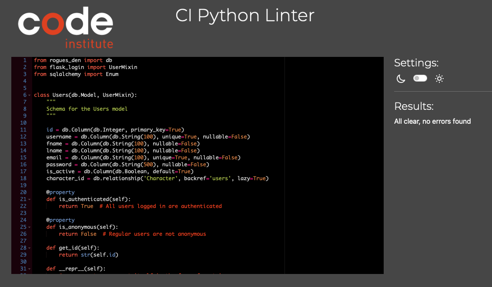

### routes.py

The initial test flagged the same as above. After rectifying the lengths the result was as follows:

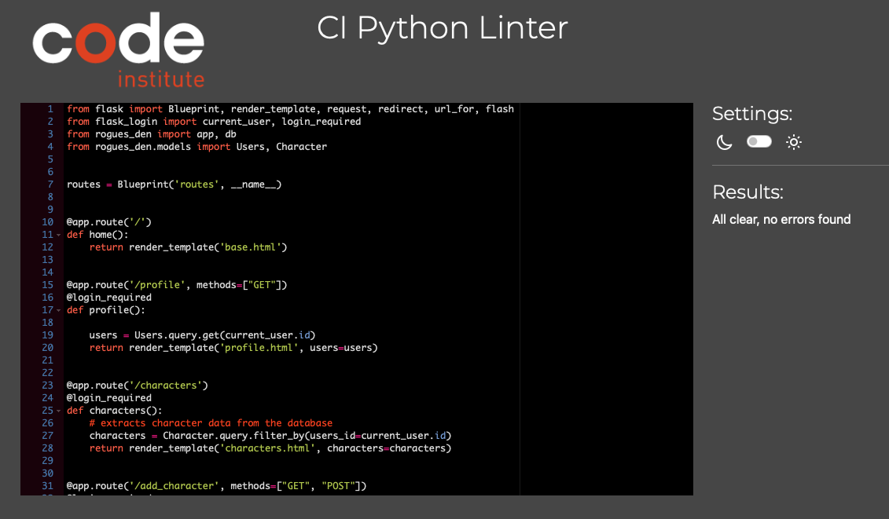

## Lighthouse

I used Lighthouse from [Google Dev Tools](https://developer.chrome.com/docs/) to test the performance, accessibility, best practices and SEO of the website on both desktop and mobile, the results were as follows:

### Desktop

#### Home

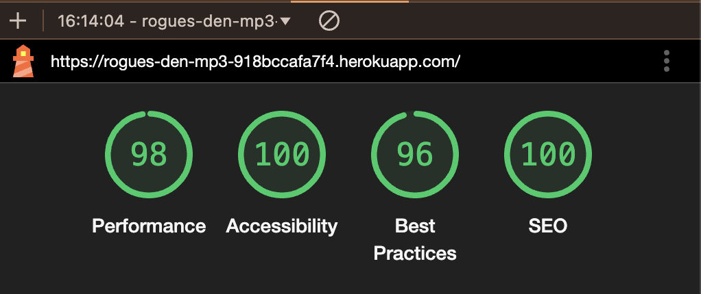

#### Login

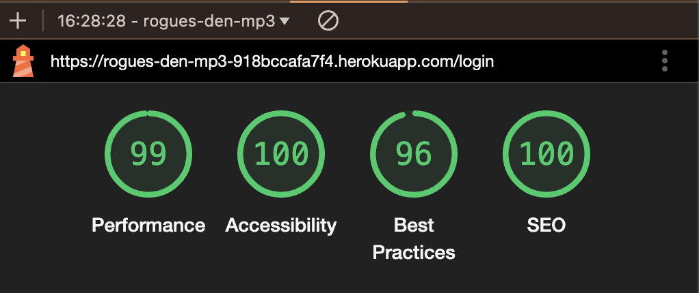

#### Register

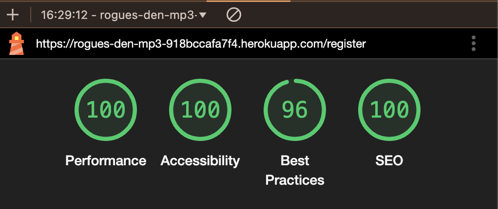

#### Characters

#### Add Character

The accessibility being lower on this page is due to labels not being set for select options. I rectified this with aria-labels.

#### View Character

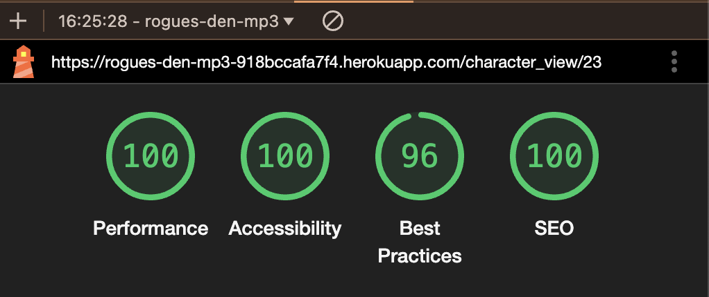

#### Edit Character

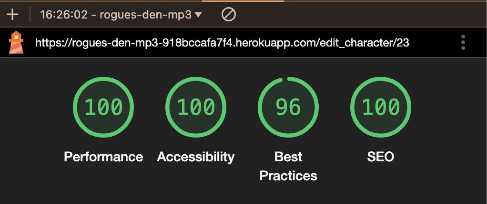

#### Profile

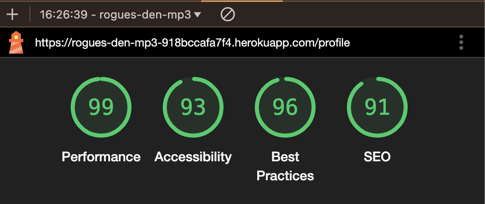

The accessibility and SEO being lower on this page is due to a lack of alt text for the profile image. I added some alt text.

### Mobile

There was an accessibility issue on all pages due to a lack of a label for the side navigation provided by Materialize. I rectified this with an aria-label.

#### Home

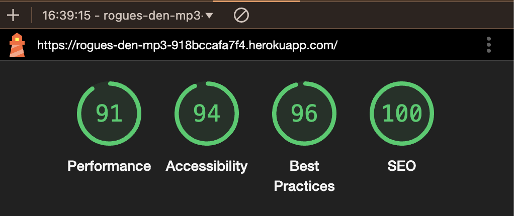

#### Login

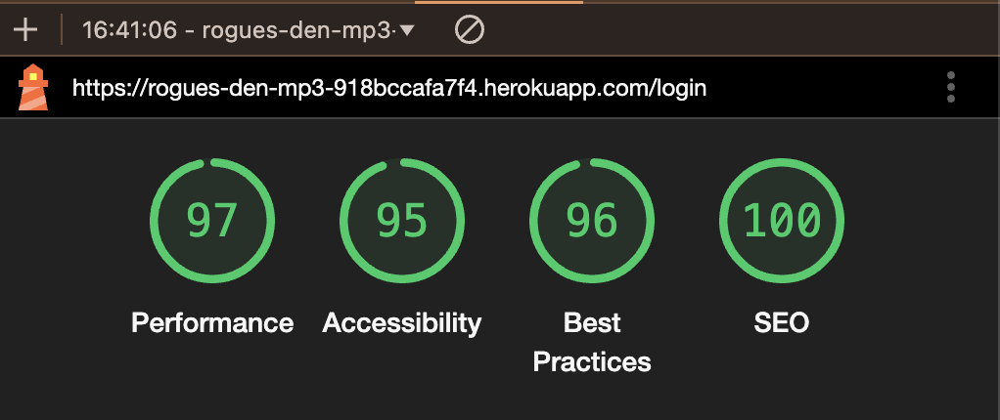

#### Register

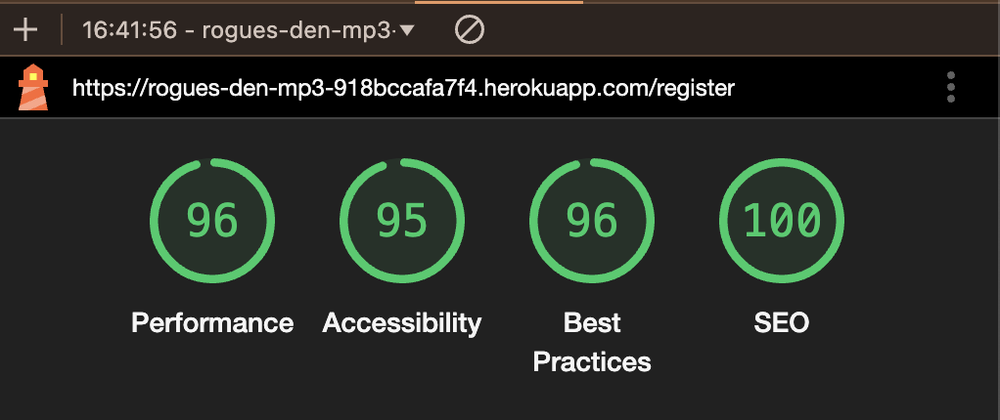

#### Characters

#### Add Character

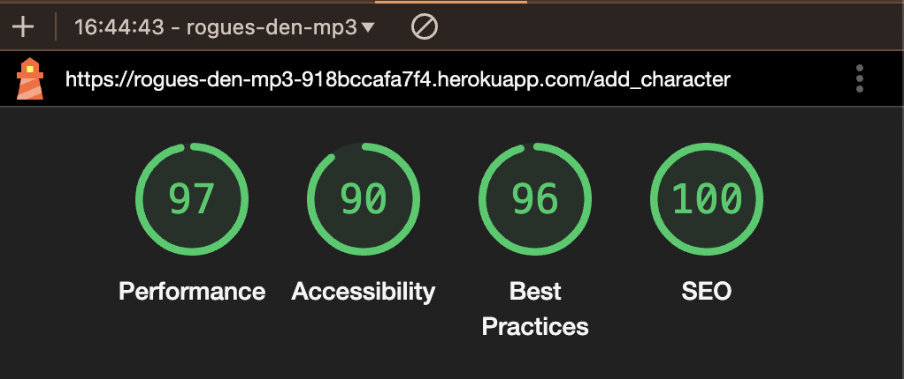

The accessibility being lower on this page is due to labels not being set for select options. I rectified this with aria-labels.

#### View Character

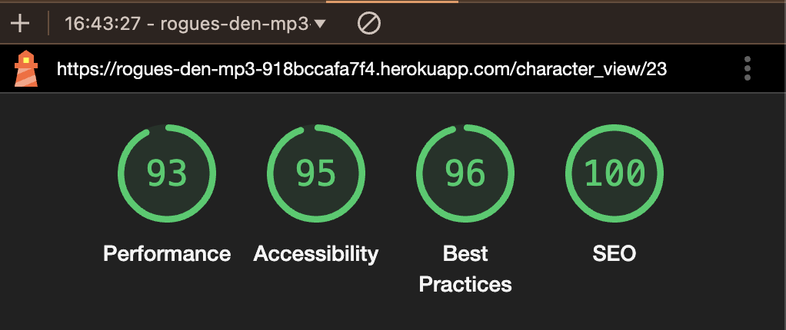

#### Edit Character

#### Profile

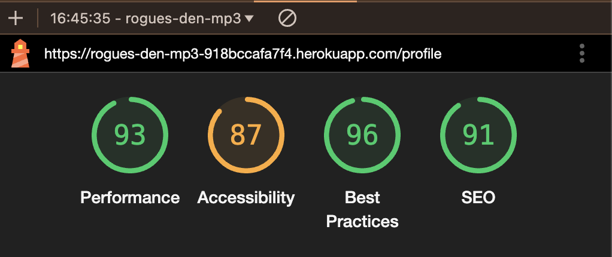

The accessibility and SEO being lower on this page is due to a lack of alt text for the profile image. I added some alt text.