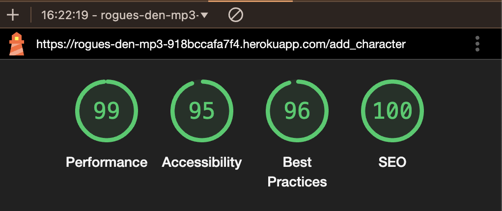

# CamRaff - Milestone Project 3 - Rogues Den

Here is a link to the deployed site: [Rogues Den](https://rogues-den-mp3-918bccafa7f4.herokuapp.com/)

---

# Contents

- [Automated](#automated)

    - [W3C HTML Validator](#w3c-html-validator)

    - [CSS Jigsaw](#css-jigsaw)

    - [JavaScript Validator](#javascript-validator)

    - [Python Validator](#python-validator)

        - [init.py](#initpy)

        - [auth.py](#authpy)

        - [models.py](#modelspy)

        - [routes.py](#routespy)

        - [run.py](#runpy)

    - [Lighthouse](#lighthouse)

        - [Desktop](#desktop)

        - [Mobile](#mobile)

- [Manual](#manual)

    - [User Stories](#user-stories)

    - [Site Feature Testing](#site-feature-testing)

- [Bugs](#bugs)

---

# Automated

## W3C HTML Validator

To test all of the HTML pages in my site, I used the [W3C HTML Validator](https://validator.w3.org/). The results for each page were as follows:

### Home

The initial test showed no errors.

### Login

The initial test brought up errors due to having class attributes set separately, as shown below:

After rectifying this issue the results were as follows:

### Register

The initial test brought up the same error as the login page with class attributes set separately:

After rectifying this issue the results were as follows: 

### Characters

The initial test showed no errors.

### View Character

The initial test showed no errors.

### Edit Character

The initial test showed no errors.

### Profile

The initial test showed no errors.

## CSS Jigsaw

To test the CSS used in the site, I used [CSS Jigsaw](https://jigsaw.w3.org/css-validator/). There were no issues flagged by the test:

## JavaScript Validator

To test the custom JavaScript used in the site, I used [JSHint](https://jshint.com/). The test results were as follows:

The undefined variable being flagged is related to the Materialize framework that I used. 

## Python Validator

To test the Python used in the site, I used the [CI Python Linter](https://pep8ci.herokuapp.com/). The results for each module were as follows:

### __init__.py

The initial test flagged some minor issues like extra blank lines needed, and also flagged an issue with imports being in the wrong place, however they were needed there for app initialisation so I had to add "# noqa" beside those lines of code. See below: 

### auth.py

The initial test flagged quite a lot of "line too long" issues. I rectified the line lengths and the result was as follows:

### models.py

The initial test flagged the same as above. I rectified the lengths and the result was as follows:

### routes.py

The initial test flagged the same as above. After rectifying the lengths the result was as follows:

### run.py

The initial test flagges no issues.

## Lighthouse

I used Lighthouse from [Google Dev Tools](https://developer.chrome.com/docs/) to test the performance, accessibility, best practices and SEO of the website on both desktop and mobile, the results were as follows:

### Desktop

#### Home

#### Login

#### Register

#### Characters

#### Add Character

The accessibility being lower on this page is due to labels not being set for select options. I rectified this with aria-labels.

#### View Character

#### Edit Character

#### Profile

The accessibility and SEO being lower on this page is due to a lack of alt text for the profile image. I added some alt text.

### Mobile

There was an accessibility issue on all pages due to a lack of a label for the side navigation provided by Materialize. I rectified this with an aria-label.

#### Home

#### Login

#### Register

#### Characters

#### Add Character

The accessibility being lower on this page is due to labels not being set for select options. I rectified this with aria-labels.

#### View Character

#### Edit Character

#### Profile

The accessibility and SEO being lower on this page is due to a lack of alt text for the profile image. I added some alt text.

# Manual

## User Stories

**First Time Visitor Goals**

| Goals | Outcome |
| ----- | ----- |
| I am new to Dungeons & Dragons and I want to find a website that will allow me to store my characters from my different campaigns. | I am able to create as many characters as I like, giving them their names, stats and a background. |
| I want to find a website that is straight forward and easy to use.  | The website is very straight forward and easy to use. You are directed straight to the character page when registering and logging in, and it is clear how to add a character. |
| I want to find a website which has a great vibe and cool visuals. | The visuals and vibe of the site are really cool. I love the images used and the font fits really well with the theme! |

**Returning Visitor Goals**

| Goals | Outcome |
| ----- | ----- |
| I want to be able to update my characters as I level up throughout my campaigns. | The view and edit features make it easy for me to update my characters from my campaigns! |

**Frequent Visitor Goals**

| Goals | Outcome |
| ----- | ----- |
| I want to see if there are any new additions to character creation and other features on the site. | The home page of the site tells me it is a work in progress, so I know to check back to see if there have been any exciting updates! |

## Site Feature Testing

In order to streamline the testing process and make this document a bit clearer and display the features better, I have decided to add gifs showing the testing of all features. 

### Navigation - Unauthorized

The below gif shows the navigational links available to all users functioning, with hover effects, and the footer link functioning with its hover effect.

### Registering

The below gif shows the registration process with prompts for passwords, the flash message, the user being directed to the characters page upon registering, as well as the navigation links changing as the user has now been authorized.

### Logging Out

The below gif shows the user being logged out from the profile page, the flash message, the user being returned to the home page and the navigation links changing back as they are now not authorized.

### Loggin In

The below gif shows the user logging in, the flash message, the user being directed to the characters page, as well as navigation links changing as the user is now authorized again.

### Adding Character

The below gif shows being directed to the add character page, creating a character, being redirected to the characters page and the flash message. The background field is not a required field, so I did not add a background. You can also see how the images differ depending on the race you've selected.

### Viewing and Editing Character

The below gif shows the character view being accessed, going back to the characters page, accessing the edit page submitting your edits and the flash message.

### Deleting Character

The below gif shows the delete modal, the character being deleted, the user being redirected to the characters page and the flash message. 

# Bugs

There is one known issue with the site and that is regarding the responsiveness of the page title on extremely small screens, however the breakpoint for this is at 365 pixels wide, and following a bit of research I found that less than 15% of the world population use phones with a screen that size, so it is not that much of an issue overall. 